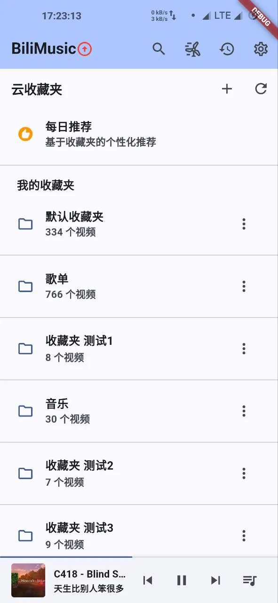
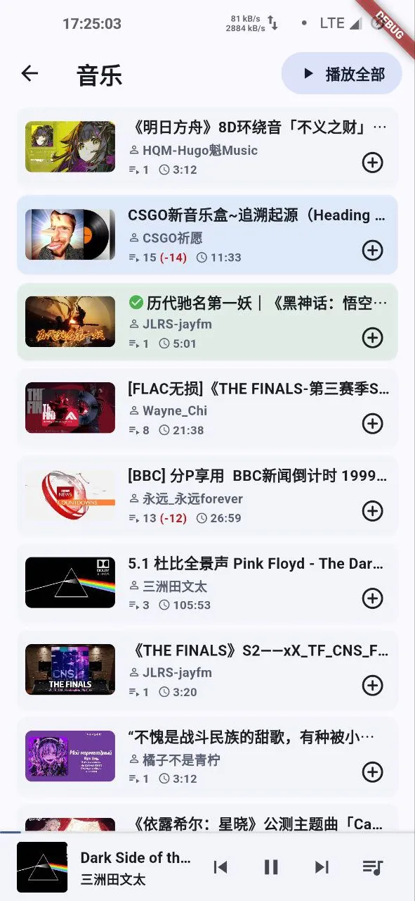
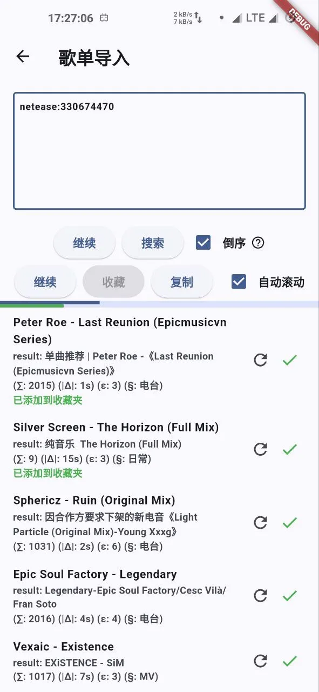
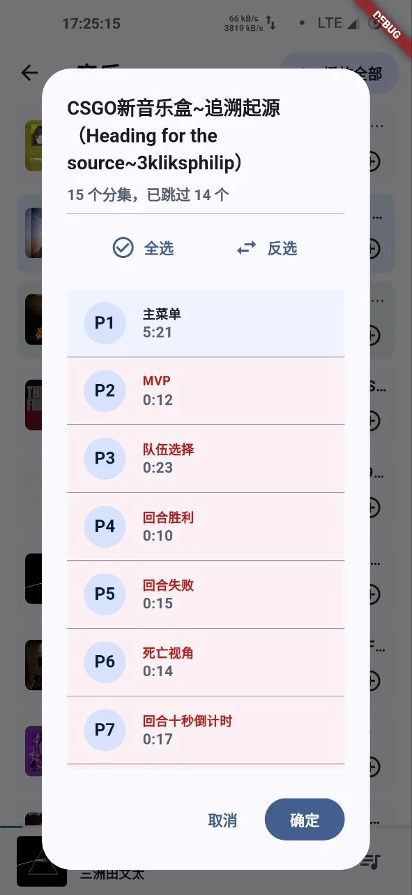
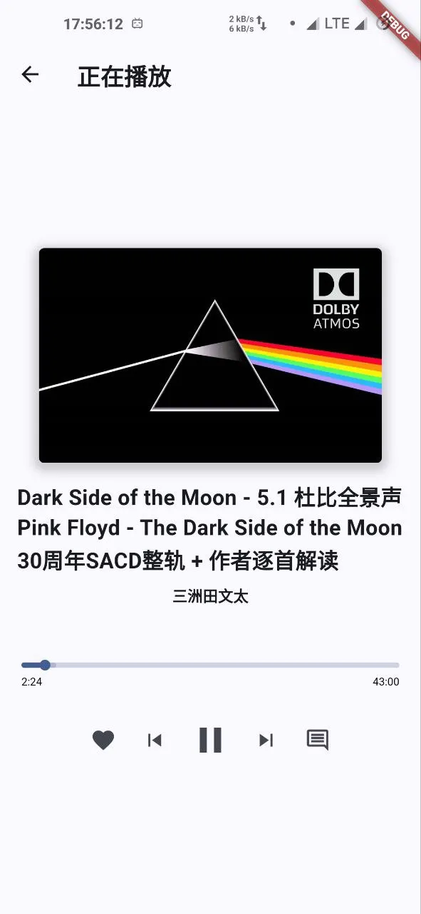
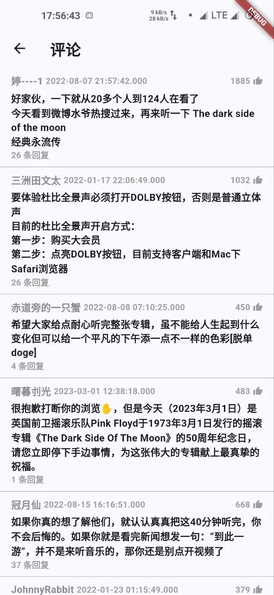
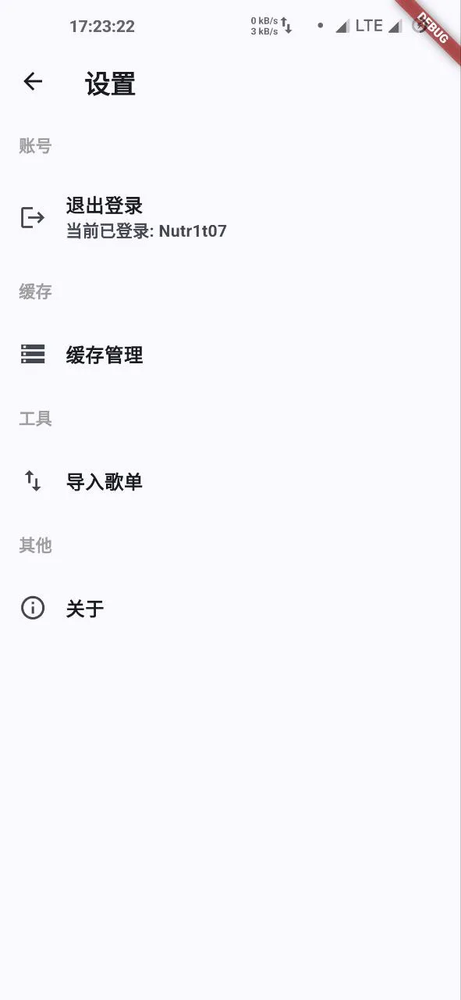
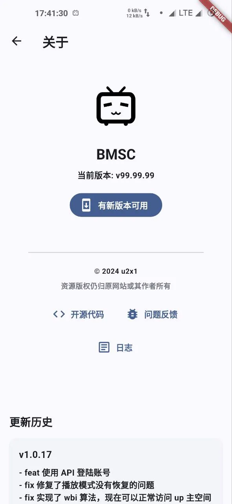

# BMSC

这是一个 Bilibili 的第三方客户端，与其他客户端不同的是，BMSC 只播放视频的音频。你可以将它作为音乐软件使用。

## Features

- 播放视频音频
- 从其他音乐平台(网易云、QQ 音乐、酷狗音乐)导入歌单
- 跳过多 P 视频中的某些分 P
- 暴力实现的每日推荐

## 截图

## 鸣谢

- [SocialSisterYi/bilibili-API-collect](https://github.com/SocialSisterYi/bilibili-API-collect): 哔哩哔哩 - API 收集整理

## 声明

本项目与哔哩哔哩官方无任何直接关联、合作或支持。本项目的所有内容仅供学习和研究用途，任何人使用本项目时，须自行承担相关法律责任。

本项目不收集、存储或转发用户的个人信息或数据，用户在使用本项目时，可能与哔哩哔哩平台发生交互，因此请用户自行阅读并理解哔哩哔哩平台的隐私政策及条款。

## 许可证

本项目基于 [Apache License 2.0](LICENSE) 许可证开源。
